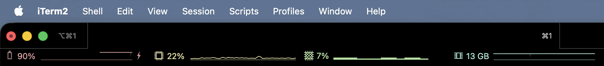

# iTerm2 GPU Status Bar

Unofficial iTerm2 GPU status bar component for macOS.



Native-ish GPU utilization for iTerm2's status bar, designed to sit next to the built-in CPU, memory, and battery components without looking like a custom dashboard.

## Features

- macOS / Apple Silicon focused.
- No sudo required for the default collector.
- Uses an `ioreg` backend with a low-overhead background collector.
- iTerm2 Python API component loaded through AutoLaunch.
- LaunchAgent keeps the collector alive after login.
- Plain native-looking status text with a small static icon and optional sparkline.

## Important Notes

- This is not an official iTerm2 feature.
- Tested on Apple Silicon.
- The default backend reads `AGXAccelerator` `PerformanceStatistics` through `ioreg`.
- iTerm2's native CPU/RAM graph renderer is not exposed through the public Python API, so this project uses a text sparkline instead.

## How It Looks

The rendered component keeps the text minimal:

```text
18%  ▁▂▃▄▅▄▃▂▃▄▅▄
```

If the GPU counter is unavailable or stale:

```text
--%  ▁▁▁▁
```

The `GPU` label is intentionally not shown in the text. The static icon identifies the metric, while the percent and sparkline follow the same left-value/right-graph structure as iTerm2's native resource widgets.

## Requirements

- macOS
- iTerm2 with Python API support
- Python 3
- Apple Silicon GPU counters exposed under `AGXAccelerator`

The default collector does not require root privileges.

## Tested With

- MacBook Pro 14-inch, 2021
- Apple M1 Pro, 14-core GPU
- 16 GB unified memory
- Built-in Liquid Retina XDR display, 3024 x 1964 Retina
- macOS 26.4.1
- iTerm2 3.6.10
- Status bar layout: Stable Positioning, Size Multiple `1`, Priority `5`, Minimum Width `0`, Maximum Width `200`

## Install

From the repo root:

```sh
REPO_DIR="$PWD"
AUTO_DIR="$HOME/Library/Application Support/iTerm2/Scripts/AutoLaunch"
AGENT_DIR="$HOME/Library/LaunchAgents"
CACHE_DIR="$HOME/.cache/iterm2-gpu"
LABEL="dev.local.iterm2-gpu-collector"

mkdir -p "$AUTO_DIR" "$AGENT_DIR" "$CACHE_DIR/scripts"

cp "$REPO_DIR/scripts/iterm2_gpu_statusbar.py" "$AUTO_DIR/iterm2_gpu_statusbar.py"
cp "$REPO_DIR/scripts/gpu_collector.py" "$CACHE_DIR/scripts/gpu_collector.py"
chmod 755 "$AUTO_DIR/iterm2_gpu_statusbar.py" "$CACHE_DIR/scripts/gpu_collector.py"

sed \
  -e "s#__INSTALL_DIR__#$CACHE_DIR#g" \
  -e "s#__HOME__#$HOME#g" \
  "$REPO_DIR/templates/dev.local.iterm2-gpu-collector.plist" \
  > "$AGENT_DIR/$LABEL.plist"

plutil -lint "$AGENT_DIR/$LABEL.plist"
launchctl bootout "gui/$(id -u)/$LABEL" 2>/dev/null || true
launchctl bootstrap "gui/$(id -u)" "$AGENT_DIR/$LABEL.plist"
launchctl enable "gui/$(id -u)/$LABEL"
```

Restart iTerm2, or run the script from `Scripts > AutoLaunch`. If your iTerm2 setup uses a custom scripts folder, copy `scripts/iterm2_gpu_statusbar.py` into that profile's AutoLaunch folder instead of the default path above.

Then open iTerm2 settings:

```text
Settings > Profiles > Session > Configure Status Bar
```

Drag the custom `GPU` component into Active Components.

Recommended profile settings:

- Layout algorithm: Stable Positioning
- Size Multiple: `1`
- Priority: `5`
- Minimum Width: `0`
- Maximum Width: `200`

This keeps the component close to iTerm2's native CPU and memory widgets. Raising Size Multiple or Minimum Width can make the component look like it owns a custom slot instead of blending into the resource cluster.

## Verify

Check that the LaunchAgent is loaded:

```sh
launchctl print "gui/$(id -u)/dev.local.iterm2-gpu-collector"
```

Check that the cache is fresh:

```sh
cat "$HOME/.cache/iterm2-gpu/gpu_usage.json"
```

Dry-run the status text:

```sh
python3 scripts/iterm2_gpu_statusbar.py \
  --dry-run \
  --cache-path "$HOME/.cache/iterm2-gpu/gpu_usage.json"
```

For repo-local validation without installing anything:

```sh
mkdir -p tmp
python3 scripts/gpu_collector.py --once --print --cache-path "$PWD/tmp/gpu_usage.json"
python3 scripts/iterm2_gpu_statusbar.py --dry-run --cache-path "$PWD/tmp/gpu_usage.json"
```

## Troubleshooting

If the status bar shows iTerm2's bug icon, first fully restart iTerm2 and
check again. This usually means the iTerm2 Python API status provider or its
local socket got stuck, not that the GPU collector or cache is broken.

## Update

```sh
LABEL="dev.local.iterm2-gpu-collector"
launchctl bootout "gui/$(id -u)/$LABEL" 2>/dev/null || true

cp "$PWD/scripts/iterm2_gpu_statusbar.py" "$HOME/Library/Application Support/iTerm2/Scripts/AutoLaunch/iterm2_gpu_statusbar.py"
cp "$PWD/scripts/gpu_collector.py" "$HOME/.cache/iterm2-gpu/scripts/gpu_collector.py"
chmod 755 "$HOME/Library/Application Support/iTerm2/Scripts/AutoLaunch/iterm2_gpu_statusbar.py"
chmod 755 "$HOME/.cache/iterm2-gpu/scripts/gpu_collector.py"

sed \
  -e "s#__INSTALL_DIR__#$HOME/.cache/iterm2-gpu#g" \
  -e "s#__HOME__#$HOME#g" \
  "$PWD/templates/dev.local.iterm2-gpu-collector.plist" \
  > "$HOME/Library/LaunchAgents/$LABEL.plist"

plutil -lint "$HOME/Library/LaunchAgents/$LABEL.plist"
launchctl bootstrap "gui/$(id -u)" "$HOME/Library/LaunchAgents/$LABEL.plist"
launchctl enable "gui/$(id -u)/$LABEL"
```

Restart iTerm2 if the icon or component registration does not refresh.

## Uninstall

```sh
LABEL="dev.local.iterm2-gpu-collector"

launchctl bootout "gui/$(id -u)/$LABEL" 2>/dev/null || true
rm -f "$HOME/Library/LaunchAgents/$LABEL.plist"
rm -f "$HOME/Library/Application Support/iTerm2/Scripts/AutoLaunch/iterm2_gpu_statusbar.py"
rm -rf "$HOME/.cache/iterm2-gpu"
```

Remove the `GPU` component from iTerm2's active status bar configuration if it still appears in the profile settings.

## How It Works

The project is split into two parts:

- `scripts/gpu_collector.py` samples GPU usage and writes a tiny JSON cache.
- `scripts/iterm2_gpu_statusbar.py` registers the iTerm2 component and reads only that cache.

The status bar callback never runs `ioreg`, `powermetrics`, or shell commands. That keeps iTerm2 responsive even if the GPU probe fails.

The collector applies EMA smoothing and small hysteresis before writing display values. This avoids flicker from tiny one-sample changes while keeping the graph responsive enough for an ambient status widget.

## Known Limitations

- Apple Silicon is the primary target.
- IORegistry counter names can change across macOS releases.
- The `ioreg` backend is a practical utilization source, not a profiler-grade measurement pipeline.
- Native iTerm2 resource graph rendering is not available to custom Python status bar components.
- `powermetrics` can expose richer GPU/ANE data, but generally requires superuser privileges and is not used by default.

## Repository Layout

```text
assets/       Icon PNGs and the README demo GIF
docs/         Design, install, verification, and tuning notes
scripts/      Collector and iTerm2 AutoLaunch component
templates/    launchd plist template
```

## Publish Checklist

Before publishing a fork or release, run:

```sh
python3 -m py_compile scripts/gpu_collector.py scripts/iterm2_gpu_statusbar.py
plutil -lint templates/dev.local.iterm2-gpu-collector.plist
rg -n '/Users/|/home/|gui/[0-9]|mac@|Trash|collector\\.out\\.log|collector\\.err\\.log' \
  --glob '!README.md' --glob '!docs/install.md' --glob '!docs/verification.md' .
```

No personal paths, local logs, cache files, or runtime agent state should be committed.
